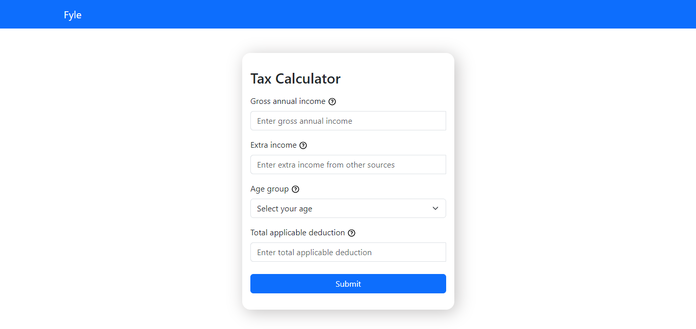
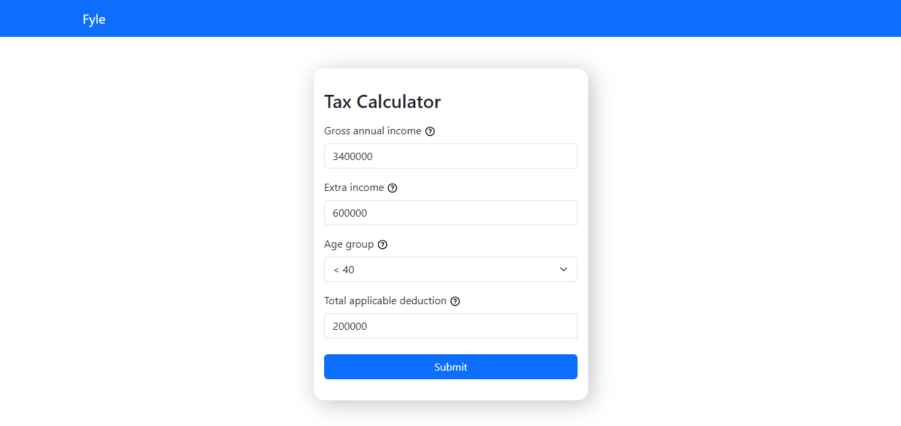
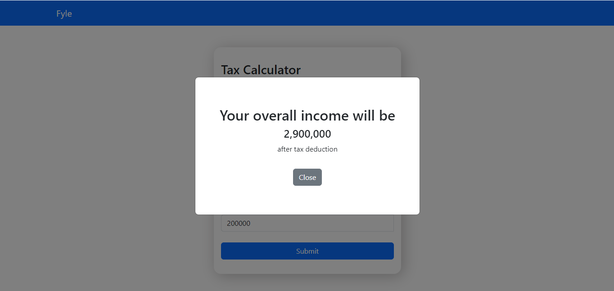
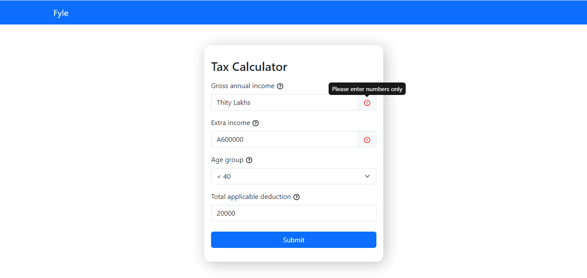
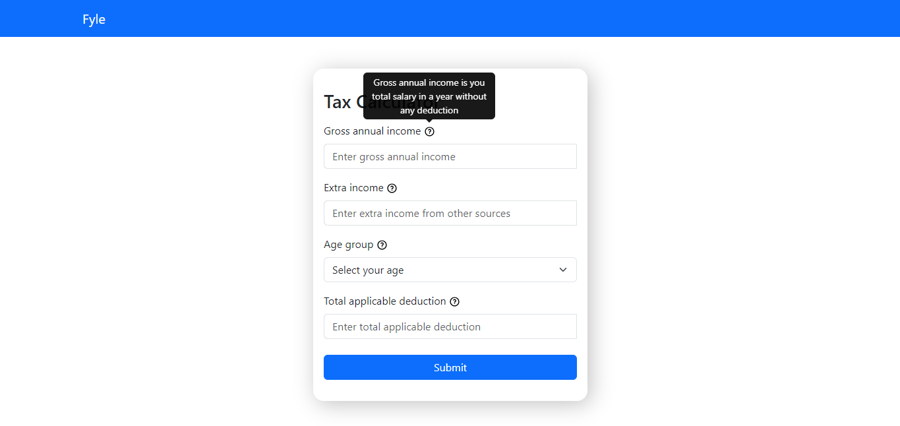
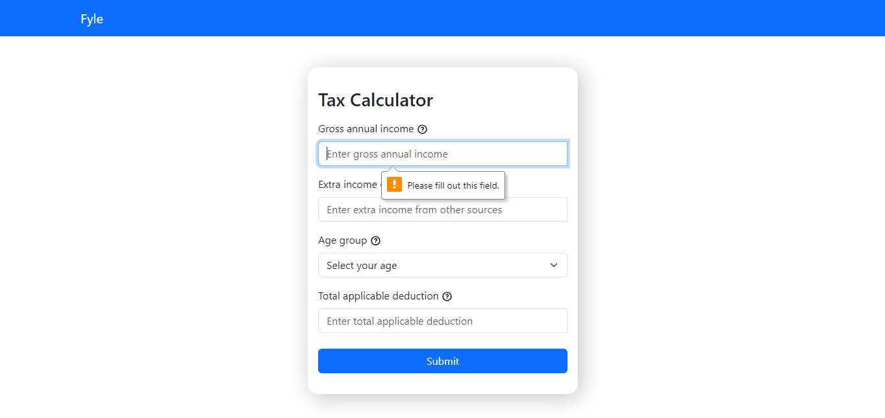

# Tax Calculator

Tax calculation based on a users input.

### References & Requirements

###### Tax Calculation Rules:

Income under 8 Lakhs is tax-exempt after deductions.

Income over 8 Lakhs is taxed based on the following rates:

- 30% for individuals under 40 years of age.
- 40% for individuals aged 40 to 59.
- 10% for individuals aged 60 and above.

Example:

Annual Income: 34 Lakhs
Extra Income: 6 Lakhs
Age: 34
Deductions: 2 Lakhs

###### Tax Calculation:

Taxable Income = Gross Annual Income + Extra Income - Deductions = 38 Lakhs

Taxable Amount = Income over 8 Lakhs = 38 - 8 = 30 Lakhs

Tax = 30% of Taxable Amount = 0.3 \* 30 = 9 Lakhs

Overall income will be = Taxable Income - Tax = 29 Lakhs

#### User Interface:

- Initial View:

"Below is the initial view of the interface."

- User Provided Inputs:

"Here are the user-provided inputs displayed on the interface."

- Modal View After Submitted User Input:

"This is the modal view displayed after the user has submitted their input."

- Entered Wrong Data (Form Validation):

"An error message is shown when incorrect data is entered. This is part of the form validation process."

- Tooltip Appearing When User Hovers Over Info Symbol:

"A tooltip appears when the user hovers over the info symbol, providing additional information."

- Clicking on Submit Button When Form is Empty (Form Validation):

"An error message is displayed when the user tries to submit the form without filling in all the required fields. This is part of the form validation process."

